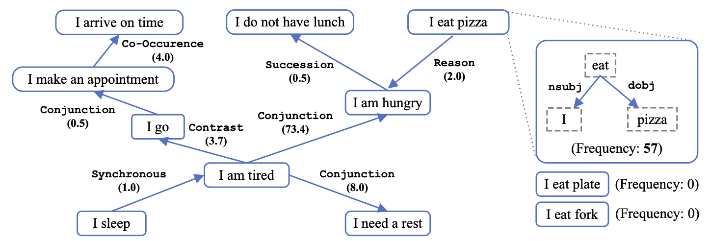

ASER (Activities, States, Events, and their Relations)
================================================================================

Introduction
--------------------------------------------------------------------------------

ASER is a large-scale weighted eventuality knowledge graph, including actions, states, events, and their relations.

The eventualities (i.e., nodes of ASER) are extracted using selected dependency patterns. The edges are based on discourse relations (e.g., Result) in discourse analysis.
Besides, conceptualized eventualities in a more abstract level and their relations are also conducted to generalize the knowledge.

In total, ASER (full) contains 438 million eventualities and 648 million edges between eventualities; ASER (core) contains 53 million eventualities and 52 million edges between eventualities.
With the help of Probase (now called Microsoft Concept Graph), ASER (concept) contains 15 million conceptualized eventualities and 224 million edges between conceptualied eventualities.

Data
--------------------------------------------------------------------------------

* `ASER 2.0 <https://arxiv.org/abs/2104.02137>`_ [`data <https://hkustconnect-my.sharepoint.com/:f:/g/personal/xliucr_connect_ust_hk/EnlOIunfqNRKsCQIBSXe9pQBL0KhLxTNMSNSJ3Mzt0bmhA?e=xm86PF>`_] [`code <https://github.com/HKUST-KnowComp/ASER/tree/master>`_]

* `ASER 1.0 <https://arxiv.org/abs/1905.00270>`_ [`data <https://hkustconnect-my.sharepoint.com/:f:/g/personal/xliucr_connect_ust_hk/EoNC-hFNEsNLrZvg73i14e8BMAUDR20TmuLY0W-6tFhKEQ?e=BveOrc>`_] [`code <https://github.com/HKUST-KnowComp/ASER/tree/release/1.0>`_]

Related Projects
--------------------------------------------------------------------------------

* `ASER Extraction, Conceptualization, Usage, and APIs <https://github.com/HKUST-KnowComp/ASER>`_

* `Transfer to OMCS <https://github.com/HKUST-KnowComp/TransOMCS>`_

* `Transfer to ATOMIC <https://github.com/HKUST-KnowComp/DISCOS-commonsense>`_

* `Eventuality Entailment Graph <https://github.com/HKUST-KnowComp/ASER-EEG>`_

* `Selectional Preference Annotation (SP-10K) <https://github.com/HKUST-KnowComp/SP-10K>`_

* `Probase <https://haixun.github.io/probase.html>`_, now known as `Microsoft Concept Graph <https://haixun.github.io/probase.html>`_

Talks
--------------------------------------------------------------------------------

* 2021 April: An Overview of Commonsense Knowledge Graph Construction and Reasoning at HKUST. Presented by Yangqiu Song. [`pdf <http://home.cse.ust.hk/~yqsong/papers/ASER-2021.04-ReminUniversity.pdf>`_] [`ppt <http://home.cse.ust.hk/~yqsong/papers/ASER-2021.04-ReminUniversity.pptx>`_]

* 2020 September: NLP with Friends. Commonsense Reasoning from the Angle of Eventualities. Presented by Hongming Zhang. [`ppt <https://hkustconnect-my.sharepoint.com/:p:/g/personal/hzhangal_connect_ust_hk/EbZn6BSgoENIhvuiKWxaZTABh3KfB0IqOqRUI83xgahBvA?e=rlKGvJ>`_] [`video <https://www.youtube.com/watch?v=pI-SiaKsR8w>`_]

* 2020 Summer: Knowledge Works at Fudan. ASER: Building a Commonsense Knowledge Graph by Higher-order Selectional Preference. Presented by Yangqiu Song. [`pdf <http://home.cse.ust.hk/~yqsong/papers/ASER-202007-KnowledgeWorks.pdf>`_] [`ppt <http://home.cse.ust.hk/~yqsong/papers/ASER-202007-KnowledgeWorks.pptx>`_]

* 2019 October: Microsoft Research Asia (MSRA). Event-centric Commonsense Reasoning with Structured Knowledge. Presented by Hongming Zhang. [`pdf <https://hkustconnect-my.sharepoint.com/:b:/g/personal/hzhangal_connect_ust_hk/ETe0bW0XPTBBs62-xDi3Qi8B0gqdzQMPZa5VFCEtwEky1Q?e=a3yXjiJ>`_]

* 2019 Summer: ASER: A Large scale Eventuality Knowledge Graph. Presented by Yangqiu Song. [`pdf <http://home.cse.ust.hk/~yqsong/papers/ASER-YangqiuSong.pdf>`_] [`ppt <http://home.cse.ust.hk/~yqsong/papers/ASER-YangqiuSong.pptx>`_]

Publications
--------------------------------------------------------------------------------

* Hongming Zhang\*, Xin Liu\*, Haojie Pan\*, Haowen Ke, Jiefu Ou, Tianqing Fang, and Yangqiu Song. ASER: Towards Large-scale Commonsense Knowledge Acquisition via Higher-order Selectional Preference over Eventualities. HKUST Technical Report, April 5th, 2021. [`pdf <https://arxiv.org/abs/2104.02137>`_]

* Changlong Yu, Hongming Zhang, Yangqiu Song, and Wilfred Ng. CoCoLM: COmplex COmmonsense Enhanced Language Model. HKUST Technical Report, 2021. [`pdf <https://arxiv.org/abs/2012.15643>`_]

* Tianqing Fang, Hongming Zhang, Weiqi Wang, Yangqiu Song, and Bin He. DISCOS: Bridging the Gap between Discourse Knowledge and Commonsense Knowledge. The Web Conference (WWW), 2021. [`pdf <https://arxiv.org/abs/2101.00154>`_]

* Hongming Zhang, Muhao Chen, Haoyu Wang, Yangqiu Song, and Dan Roth. Analogous Process Structure Induction for Sub-event Sequence Prediction. Conference on Empirical Methods in Natural Language Processing (EMNLP). 2020. [`pdf <https://arxiv.org/abs/2010.08525>`_]

* Changlong Yu, Hongming Zhang, Yangqiu Song, Wilfred Ng, and Lifeng Shang . Enriching Large-Scale Eventuality Knowledge Graph with Entailment Relations. Conference on Automated Knowledge Base Construction (AKBC). 2020. [`pdf <https://openreview.net/forum?id=-oXaOxy6up>`_]

* Hongming Zhang, Daniel Khashabi, Yangqiu Song, and Dan Roth. TransOMCS: From Linguistic Graphs to Commonsense Knowledge. International Joint Conference on Artificial Intelligence (IJCAI). 2020. [`pdf <https://arxiv.org/abs/2005.00206>`_]

* Mutian He, Yangqiu Song, Kun Xu, and Yu Dong. On the Role of Conceptualization in Commonsense Knowledge Graph Construction. HKUST Technical Report, March 6th, 2020. [`pdf <https://arxiv.org/abs/2003.03239>`_]

* Hongming Zhang\*, Xin Liu\*, Haojie Pan\*, Yangqiu Song, and Cane Wing-Ki Leung. ASER: A Large-scale Eventuality Knowledge Graph. The Web Conference (WWW), 2020. (Previously a Technical Report at HKUST, May 2019) [`pdf <https://arxiv.org/abs/1905.00270>`_] [`ppt <http://home.cse.ust.hk/~yqsong/papers/ASER-WWW20.pptx>`_]

* Hongming Zhang, Hantian Ding, and Yangqiu Song. SP-10K: A Large-Scale Evaluation Set for Selectional Preference Acquisition. Annual Meeting of the Association for Computational Linguistics (ACL). 2019. [`pdf <https://arxiv.org/abs/1906.02123>`_]

.. Tutorial
.. --------------------------------------------------------------------------------

.. toctree::
   :maxdepth: 2
   :caption: Tutorial

   tutorial/get-started

.. API Reference
.. --------------------------------------------------------------------------------

.. toctree::
   :maxdepth: 2
   :caption: API Reference

   api/database
   api/extractor
   api/conceptualizer
   api/aser-cs

.. About
.. --------------------------------------------------------------------------------

.. toctree::
   :maxdepth: 1
   :caption: About
   :glob:

   about/index

API Index
--------------------------------------------------------------------------------

* :ref:`genindex`

